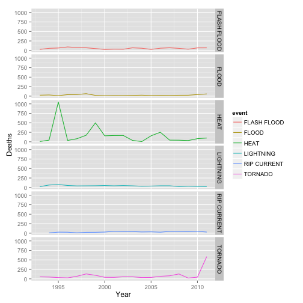
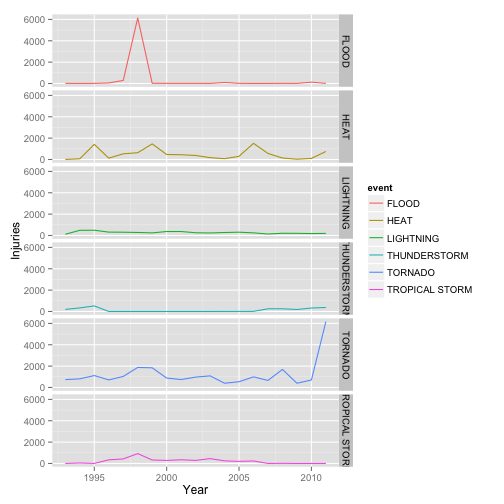
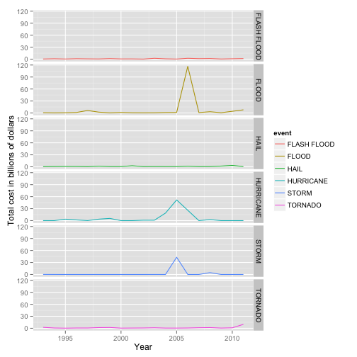

# Understanding the cost in health, lifes and money caused by natural disasters

## Synopsis

In this analysis we consider the damage cost, amount of deaths and injuries caused by natural events throughout the US. Our goal is to evaluate the events and their health and damage costs and offer an overview of which ones are more common, more expensive and cause more health problems (both deaths and injuries) to the population so we can focus investments on them to diminish their effects.

## Setup

Here we load the libraries used throughout the analysis.


```r
library(plyr)
library(ggplot2)
```

## Data processing

The data is taken from the [U.S. National Oceanic and Atmospheric Administration's (NOAA) storm database](https://d396qusza40orc.cloudfront.net/repdata%2Fdata%2FStormData.csv.bz2). The data contains events recorded from 1950 to 2011. Our first step is to load the data to be used from the BZIP file provided. Here we load the data right from the BZIP file, loading only the columns we actually care about.


```r
zip <- bzfile("repdata-data-StormData.csv.bz2")
data <- read.csv(zip,
                 strip.white=TRUE,
                 colClasses=c("NULL","character","NULL","NULL","numeric","character","character","character", "NULL",
"NULL","NULL","character","NULL","NULL","NULL","NULL", "NULL","NULL","NULL","NULL","NULL","NULL","numeric","numeric",
"numeric","character", "numeric","character","NULL","NULL","NULL","NULL","NULL","NULL","NULL", "NULL","NULL"))
```

After that, we normalize the `EVTYPE` column because not all values are cleaned up of leading and trailing whitespace or in uppercase.


```r
normalizeEvent <- function (x) toupper(gsub("^\\s+|\\s+$", "", x))
data$EVTYPE <- normalizeEvent(data$EVTYPE)
```

While evaluating the dataset, it's visible that some of the event types are duplicate with different names, so the [replacements.csv](https://github.com/mauricio/reproductible-research-assignment-2/blob/master/replacements.csv) file was created to map the event types to make sure we are correctly counting and summing the data for the events. Building this file is, unfortunately, a manual process, since we have to compare the event types and account for typos and names that are almost the same like mapping *FLASH FLOOODING* to *FLASH FLOOD*.


```r
replacements <- read.csv("replacements.csv", stringsAsFactors=FALSE)

eventFor <- function( evtype ) {
  replacements[replacements$event == evtype,]$actual
}
data$event <- mapply(eventFor, data$EVTYPE)
```

What we did for this was generate a file with all event types and then manually included a new column called `actual` that has the real name for that event type.

Once the data is fully normalized we set the `date` field and the `year` field since we will use them for plots, means and summaries of the data.


```r
data$date <- as.Date(data$BGN_DATE, "%m/%d/%Y")
data$year <- as.POSIXlt(data$date)$year+1900
```

The property and crop damage fields have a separate field to indicate it's magnitude, `PROPDMGEXP` for property damage and `CROPDMGEXP` and we have to use them to calculate the actual values for damage. First, we have to normalize them to all uppercase values and then we will setup their multipliers correctly.


```r
data$PROPDMGEXP <- toupper(data$PROPDMGEXP)
data$CROPDMGEXP <- toupper(data$CROPDMGEXP)
unique(data$PROPDMGEXP)
```

```
##  [1] "K" "M" ""  "B" "+" "0" "5" "6" "?" "4" "2" "3" "H" "7" "-" "1" "8"
```

```r
unique(data$CROPDMGEXP)
```

```
## [1] ""  "M" "K" "B" "?" "0" "2"
```

As you can see, these values are not only the `K`, `M` and `B` that are shown at the documentation, which probably means whoever entered the information wasn't really paying much attention. Due to this, we have to build our own multiplier mapping to generate the actual value to be used.


```r
multipliers <- read.csv("multipliers.csv", colClasses=c("character", "numeric"))
print(multipliers)
```

```
##    key number
## 1    K  1e+03
## 2    M  1e+06
## 3    B  1e+09
## 4    H  1e+02
## 5    +  1e+00
## 6    -  1e+00
## 7    ?  1e+00
## 8       1e+03
## 9    0  1e+00
## 10   1  1e+00
## 11   2  2e+00
## 12   3  3e+00
## 13   4  4e+00
## 14   5  5e+00
## 15   6  6e+00
## 16   7  7e+00
## 17   8  8e+00
```

This table was manually built and saved as the `multipliers.csv` file we will load and calculate the values below:


```r
mapDamage <- function(damage, mapping) {
  damage * multipliers[multipliers$key == mapping,]$number
}
data$property_damage <- mapply(mapDamage, data$PROPDMG, data$PROPDMGEXP)
data$crop_damage <- mapply(mapDamage, data$CROPDMG, data$CROPDMGEXP)
data$total_damage <- data$property_damage + data$crop_damage
```

## Filtering and subsetting

Since the data goes back a long time, it's important to evaluate the quality and diversity of the data we have throughout the years, one way to do this is to count how many different events we had every year:


```r
ddply(
  data,
  .(year),
  summarise,
  count=length(unique(event))
  )
```

```
##    year count
## 1  1950     1
## 2  1951     1
## 3  1952     1
## 4  1953     1
## 5  1954     1
## 6  1955     3
## 7  1956     3
## 8  1957     3
## 9  1958     3
## 10 1959     3
## 11 1960     3
## 12 1961     3
## 13 1962     3
## 14 1963     3
## 15 1964     3
## 16 1965     3
## 17 1966     3
## 18 1967     3
## 19 1968     3
## 20 1969     3
## 21 1970     3
## 22 1971     3
## 23 1972     3
## 24 1973     3
## 25 1974     3
## 26 1975     3
## 27 1976     3
## 28 1977     3
## 29 1978     3
## 30 1979     3
## 31 1980     3
## 32 1981     3
## 33 1982     3
## 34 1983     3
## 35 1984     3
## 36 1985     3
## 37 1986     3
## 38 1987     3
## 39 1988     3
## 40 1989     3
## 41 1990     3
## 42 1991     3
## 43 1992     3
## 44 1993    59
## 45 1994    67
## 46 1995    98
## 47 1996    77
## 48 1997    78
## 49 1998    70
## 50 1999    74
## 51 2000    65
## 52 2001    77
## 53 2002    65
## 54 2003    43
## 55 2004    37
## 56 2005    41
## 57 2006    43
## 58 2007    44
## 59 2008    44
## 60 2009    44
## 61 2010    44
## 62 2011    44
```

Before 1993 the only event types that we had records were:


```r
unique(data[data$year <= 1992,]$event)
```

```
## [1] "TORNADO"        "TROPICAL STORM" "HAIL"
```

And with this in mind, it's better to ignore these years and only work on data from 1993 and onwards since it contains many more items for us to consider.


```r
filteredData <- data[data$year >= 1993,]
```

## Results

### Population health consequences

When considering health consequences, we have two different variables to consider, the amount of deaths and people injured by the events. Since each one of these variables has it's own consequences on health, economy and more, let's start by thinking about them in separate and then getting them together.

Let's start by building the organized collection of health consequences by event:


```r
healthConsequences <- ddply(
  filteredData,
  .(event),
  summarise,
  total_deaths=sum(FATALITIES),
  total_injuries=sum(INJURIES)
  )
```

Now let's find the top even types for both deaths and injuries:


```r
mostDeadly <- healthConsequences[with(healthConsequences, order(-total_deaths)),]
head(mostDeadly)
```

```
##           event total_deaths total_injuries
## 78         HEAT         3134           9176
## 166     TORNADO         1646          23328
## 59  FLASH FLOOD         1035           1800
## 111   LIGHTNING          817           5232
## 147 RIP CURRENT          577            529
## 60        FLOOD          508           6870
```

```r
mostDeadlyEvents <- head(mostDeadly)$event

mostInjuries <- healthConsequences[with(healthConsequences, order(-total_injuries)),]
head(mostInjuries)
```

```
##              event total_deaths total_injuries
## 166        TORNADO         1646          23328
## 78            HEAT         3134           9176
## 60           FLOOD          508           6870
## 111      LIGHTNING          817           5232
## 168 TROPICAL STORM          313           4113
## 164   THUNDERSTORM          201           2452
```

```r
mostInjuriesEvents <- head(mostInjuries)$event
```

Now let's look at how the deaths are spread over the period we have:


```r
healthConsequencesByYear <- ddply(
  filteredData,
  .(year, event),
  summarise,
  total_deaths=sum(FATALITIES),
  total_injuries=sum(INJURIES)
  )

qplot(year, total_deaths, data = healthConsequencesByYear[healthConsequencesByYear$event %in% mostDeadlyEvents,], facets = event ~ ., geom="line", color=event, ylab="Deaths", xlab="Year")
```

 

And plotting injuries over time:


```r
qplot(year, total_injuries, data = healthConsequencesByYear[healthConsequencesByYear$event %in% mostInjuriesEvents,], facets = event ~ ., geom="line", color=event, ylab="Injuries", xlab="Year")
```

 

Since we saw both in separate terms, let's look at the intersection of the two top sets to see how much they look alike:


```r
intersect(mostDeadlyEvents, mostInjuriesEvents)
```

```
## [1] "HEAT"      "TORNADO"   "LIGHTNING" "FLOOD"
```

And the ones that are different among both sets:


```r
setdiff(mostDeadlyEvents, mostInjuriesEvents)
```

```
## [1] "FLASH FLOOD" "RIP CURRENT"
```

With this we can see that, joining the two sets, we end up with the following items as the top health problems caused by natural disasters:


```r
union(mostDeadlyEvents, mostInjuriesEvents)
```

```
## [1] "HEAT"           "TORNADO"        "FLASH FLOOD"    "LIGHTNING"     
## [5] "RIP CURRENT"    "FLOOD"          "TROPICAL STORM" "THUNDERSTORM"
```

So these should be events with most investment since they are the ones causing more health problems for the population.

### Greatest economic consequences

To find the biggest economic costs, we need to build a new dataset around the events and their total costs:


```r
economicConsequences <- ddply(
  filteredData,
  .(event),
  summarise,
  total_damage=sum(total_damage)/1000000000
  )
economicConsequences <- economicConsequences[with(economicConsequences, order(-total_damage)),]
```

With this in hand, let's look a the top 6 events in our dataset:


```r
head(economicConsequences)
```

```
##           event total_damage
## 60        FLOOD       150.76
## 94    HURRICANE        90.27
## 160       STORM        47.97
## 166     TORNADO        28.36
## 75         HAIL        19.02
## 59  FLASH FLOOD        18.44
```

So, since 1993, these are the most expensive natural disasters we have (the cost is in billions of dollars).

Now let's look at how these costs for the top events are distributed over the years:


```r
topEconomicEvents <- head(economicConsequences)$event
economicConsequencesByYear <- ddply(
  filteredData[filteredData$event %in% topEconomicEvents,],
  .(year,event),
  summarise,
  total_damage=sum(total_damage)/1000000000
  )
qplot(year, total_damage, data = economicConsequencesByYear,geom="line", color=event, ylab="Total cost in billions of dollars", xlab="Year",facets = event ~ .)
```

 

And with this information we should be able to see that floods are the most expensive event of all the ones we have by a long margin, so we should definitely invest more in flood protection mechanisms, but we shoulnd't ignore the costs of hurricanes, storms and tornadoes, since even if they're not as expensive as floods were, they're still real problems and also cost billions of dollars to rebuild.

### Intersecting problems

As you might have noticed, we do have events repeated between the health issues and economic costs, they are:


```r
intersect(union(mostDeadlyEvents, mostInjuriesEvents), topEconomicEvents)
```

```
## [1] "TORNADO"     "FLASH FLOOD" "FLOOD"
```

Given these 3 are the ones causing a considerable part of the problem, working to avert them or diminish their influence will surely improve the outcome for the population the next time they happen.
